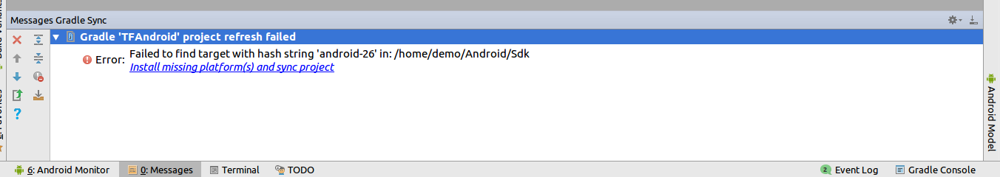
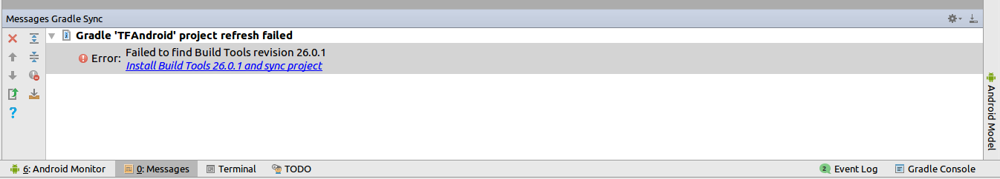
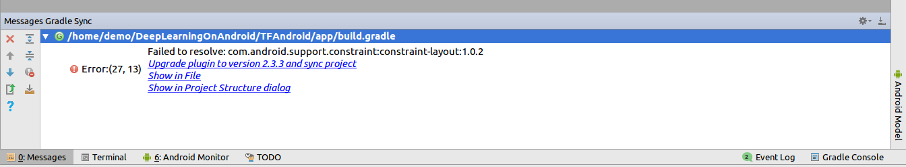
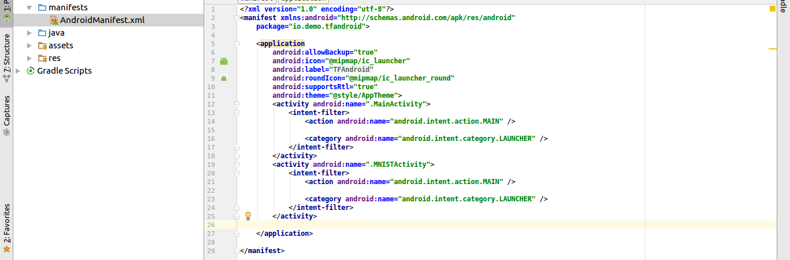
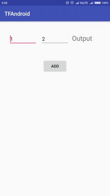
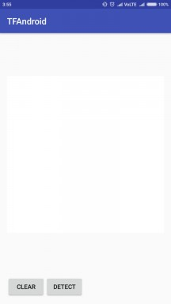

## 1.Setup python environment
To use this repo first you need to setup a python environment with tensorflow and jupyter notebook dependency
### Install anaconda (or virtuaenv perhaps)
My prefered python environment manager is Anaconda
* https://conda.io/docs/user-guide/install/index.html

### Install tensorflow and jupyter
After you have activated your python environment
```shell
pip install --upgrade tensorflow    # cpu version
pip install --upgrade jupyter 
```
### Test tensorflow and jupyter
- run these commands in python terminal to check tensorflow
```python
import tensorflow as tf
print(tf.__version__)
```
- run this command in terminal to check jupyter notebook. To shutdown notebook press **CTRL+C** 2 times.
```shell
jupyter notebook
```

## 2.Running the provided "ready to run" app
After python is setup we need to check if our android environment is ready to deploy the models we will be training. I have provided a complete android app with 3 tensorflow models preinstalled in app. We will run the app to see them in action and later replace provided models with models we will be training.

### Install android studio
* https://developer.android.com/studio/install.html

### Open TFAnroid app in android studio 
This should be fairly simple.
### Common errors and warning at first run
When opening the Android project for first time you may encounter error and warning like these in images below, to resolve them simply **click install or upgrade** which ever is appropriate. This may do some one time heavy downloads, which **can take some time to complete.**






### Run app on an android device -> add tensorflow dependency and sync
Pay attention to this section. In most existing tutorials online, authors ask you to add native tensorflow libs and use java JNI interface to bring tensorflow superpowers to your android app. **This is totally not required.**

To add deep learning capabilities to your any android app, just add this gradle dependency into ***build.gradle*** of your app. Thats it. Everything else will be automatically handled. **There is no need to downloads native libs and .so files , manually add them to your project or use JNI interface (unles you really wish to show off your c++ capabilities).**

```gradle
dependencies {
    compile 'org.tensorflow:tensorflow-android:1.4.0'
}

```

Pay attention to your android manifest file which should look something like this. We have two activities ***.MAINActivity*** and ***.MNISTActivity*** registered as launcher activity.




### Check both apps
Now we can run the app and see it running on a phone. If **.MAINActivity** entry is above the **.MNISTActivity** you will see this page open when you run the app


or this page if .MNSTActivity is above


**try both apps by switching positions of the activities entries there, simple addition in first app and draw and detect of single digits is second app. Else you will have two apps installed with name TF-MNIST and TF-BASIC, run from there. You may need to kill the first app before opening second app.**
